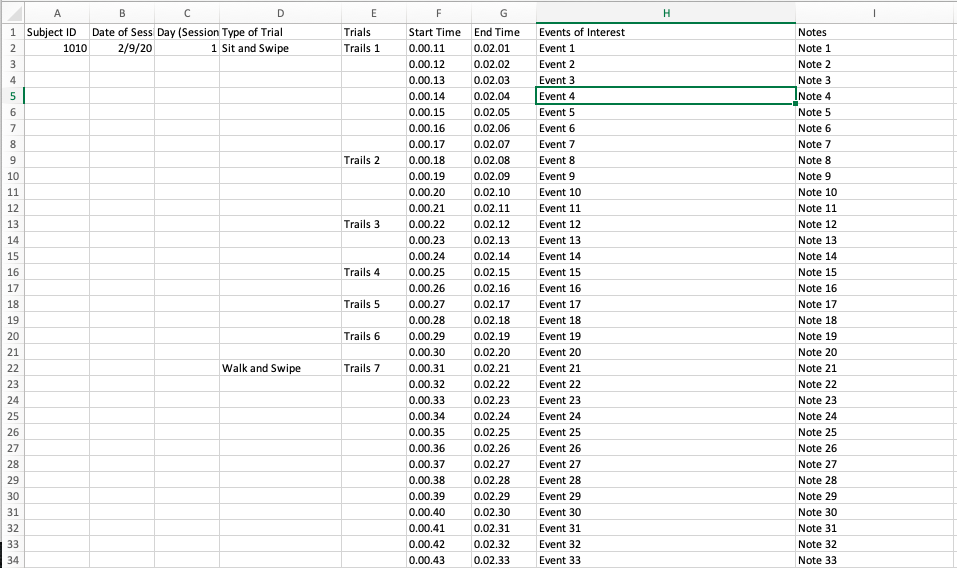
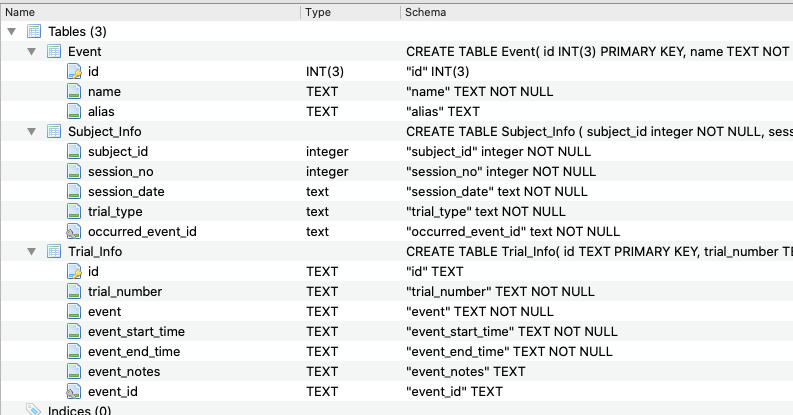

# Annotation
## SQLite3 Database written in Python to convert Annotation data from Excel files to a SQLite Database 

The purpose of this project is to read data from excel files and store it in a more organized and easy to use way in a SQLite database. 

## How it works:

This is the template of the excel files that were used to design the database. Here some of the fields are empty such as the userID field which only has value on top row and the rest of the rows are assumed to have the same value. The same applies for other fields such as the Type of Trial Field or the Date (Session) Fileld. Since its not a good practise the leave rows empty in the database, the program automatically fills them up, hence not allowing for any empty fields in the database. 

The program also links the data from the Trials with the data in the Events file which is just a list of different types of events and their aliases. 

The generated database consists of three tables, one table with all the event information, one table for the Trial Information, and lastly one table with the Subject information as shown the picture below:

## Usage Instructions:
1. Put all the excel files in the Excel Files folder. 
2. Open UserList.txt  file and write the name of all the excel files on a separate line (so for example if the file name is file.csv, write down file.csv on a new line in UserList.txt file).
3. Make sure that the file headings are correct and there are no spelling mistakes. 
4. Run the script file (program.py)
5. The program reads through all the files in the order they were put in the UserList.txt file. Once its done reading, you will get a success message printed on the console. 
6. You can see a new file annotationDB.db created in the folder.

